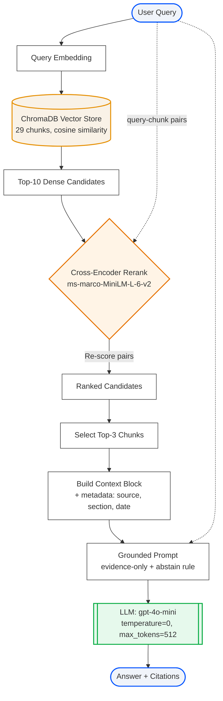

# Architecture — RAG Pipeline (Day 08 Lab)

> Template: Điền vào các mục này khi hoàn thành từng sprint.
> Deliverable của Documentation Owner.

## 1. Tổng quan kiến trúc

```
[Raw Docs]
    ↓
[index.py: Preprocess → Chunk → Embed → Store]
    ↓
[ChromaDB Vector Store]
    ↓
[rag_answer.py: Query → Retrieve → Rerank → Generate]
    ↓
[Grounded Answer + Citation]
```

**Mô tả ngắn gọn:**

Nhóm phát triển một hệ thống RAG nội bộ giúp tra cứu và trả lời tự động các câu hỏi về chính sách, quy trình vận hành và hỗ trợ nội bộ công ty. Hệ thống hiện tích hợp 5 tài liệu thuộc các lĩnh vực IT Security, HR, IT Support và Customer Service, nhằm hỗ trợ nhân viên và các bộ phận liên quan tra cứu thông tin chính xác, nhanh chóng và luôn dựa trên tài liệu chính thức.

---

## 2. Indexing Pipeline (Sprint 1)

### Tài liệu được index
| File | Nguồn | Department | Số chunk |
|------|-------|-----------|---------|
| `policy_refund_v4.txt` | policy/refund-v4.pdf | CS | 6 |
| `sla_p1_2026.txt` | support/sla-p1-2026.pdf | IT | 5 |
| `access_control_sop.txt` | it/access-control-sop.md | IT Security | 7 |
| `it_helpdesk_faq.txt` | support/helpdesk-faq.md | IT | 6 |
| `hr_leave_policy.txt` | hr/leave-policy-2026.pdf | HR | 5 |

### Quyết định chunking

| Tham số              | Giá trị          | Lý do |
|----------------------|------------------|-------|
| Chunk size           | 400 tokens       | Đủ lớn để chứa một phần nội dung logic (1–2 điều khoản hoặc 1 section nhỏ), nhưng vẫn ngắn gọn để giữ độ chính xác khi retrieve và tránh vượt giới hạn context của LLM. |
| Overlap              | 80 tokens        | Đảm bảo ngữ cảnh chuyển tiếp giữa các chunk, giảm tình trạng cắt ngang câu hoặc ý quan trọng, đặc biệt hữu ích khi chunking theo section. |
| Chunking strategy    | Heading-based + Paragraph fallback | Ưu tiên tách theo heading tự nhiên (`=== Section ... ===` hoặc `=== Phần ... ===`) để giữ cấu trúc tài liệu, sau đó mới split theo paragraph và kích thước nếu section quá dài. Giúp chunk có ý nghĩa rõ ràng và dễ citation hơn. |
| Metadata fields      | source, section, department, effective_date, access | Phục vụ filter theo bộ phận (department), kiểm tra độ mới (effective_date), kiểm soát quyền truy cập (access), và hỗ trợ citation chính xác khi trả lời người dùng. |

### Embedding model
- **Model**: paraphrase-multilingual-MiniLM-L12-v2
- **Vector store**: ChromaDB (PersistentClient)
- **Similarity metric**: Cosine

---

## 3. Retrieval Pipeline (Sprint 2 + 3)

### Baseline (Sprint 2)
| Tham số | Giá trị |
|---------|---------|
| Strategy | Dense (embedding similarity) |
| Top-k search | 10 |
| Top-k select | 3 |
| Rerank | Không |

### Variant (Sprint 3) — Dense + Rerank

> **Tuân thủ A/B Rule:** chỉ đổi **đúng 1 biến** so với baseline (`use_rerank: False → True`). Các variant khác (Hybrid-only, Hybrid + Rerank) được thử nghiệm song song và ghi lại đầy đủ trong [`tuning-log.md`](tuning-log.md) để so sánh, nhưng **variant được chọn chính thức để chạy grading là Dense + Rerank**.

| Tham số | Giá trị | Thay đổi so với baseline |
|---------|---------|------------------------|
| Strategy | Dense (embedding similarity) | Giữ nguyên |
| Top-k search | 10 | Giữ nguyên |
| Top-k select | 3 | Giữ nguyên |
| **Rerank** | **Cross-encoder (ms-marco-MiniLM-L-6-v2)** | **Thêm bước Rerank ← biến duy nhất thay đổi** |
| Query transform | Không | Giữ nguyên |

**Lý do chọn biến này:**
> Baseline cho thấy retriever Dense đã mang đủ evidence (**Context Recall = 5.00/5** — mọi expected source đều được retrieve). Vấn đề không nằm ở "tìm đủ chunk" mà ở "chọn đúng 3 chunk tốt nhất đưa vào prompt" — trong top-3 vẫn có chunk nhiễu (tangentially-related) ảnh hưởng Faithfulness và Relevance. Cross-encoder rerank chấm lại từng cặp `(query, chunk)` trên top-10 candidates bằng mô hình được fine-tune cho ranking → giữ top-3 thật sự liên quan → tăng Faithfulness + Relevance mà **không cần đụng tới retrieval pipeline** (giữ đúng A/B rule).
>
> Nhóm cũng đã thử `retrieval_mode = hybrid` (Variant 2) nhưng không cải thiện do corpus nhỏ (29 chunks) và BM25 tokenize tiếng Việt yếu (`text.lower().split()` — không xử lý dấu/từ ghép). Chi tiết bằng chứng ở `tuning-log.md §Variant 2`.

**Kết quả thực tế (scorecard):**

|Metric|Baseline (Dense)|Variant (Dense + Rerank)|Delta|
|------|----------------|------------------------|-----|
|Faithfulness|4.20 / 5|**4.30 / 5**|**+0.10**|
|Answer Relevance|4.20 / 5|**4.50 / 5**|**+0.30**|
|Context Recall|5.00 / 5|5.00 / 5|0.00|
|Completeness|4.00 / 5|4.00 / 5|0.00|

> Variant thắng baseline rõ ràng ở Relevance mà không giảm metric nào → đây là cấu hình được dùng trong `run_grading.py` (`VARIANT_CONFIG`).

---

## 4. Generation (Sprint 2)

### Grounded Prompt Template
```
Answer only from the retrieved context below.
If the context contains enough information:
- Provide a short, clear, factual answer.
- Cite the source field (in brackets like [1]) when possible.

If the context does NOT contain enough information:
- DO NOT guess or fabricate.
- Instead, respond in a helpful way:
  + State that you could not find the answer in the provided context.
  + Suggest 1-2 concrete next steps (e.g., refine keywords, search broader documents, contact relevant department).
  + Optionally suggest related keywords or what information is missing.

Additional rules:
- Respond in the same language as the question.
- If there is conflict between documents, list all conflicting sources and point out where they differ.
- Do not infer information not explicitly stated in the context.

Question: {query}

Context:
{context_block}
```

### LLM Configuration
| Tham số | Giá trị |
|---------|---------|
| Model | gpt-4o-mini |
| Temperature | 0 (để output ổn định cho eval) |
| Max tokens | 512 |

---

## 5. Failure Mode Checklist

> Dùng khi debug — kiểm tra lần lượt theo thứ tự: **index → retrieval → generation**

| # | Failure Mode | Triệu chứng | Nguyên nhân thường gặp | Cách kiểm tra / Fix |
|---|-------------|-------------|----------------------|---------------------|
| 1 | **Index lỗi / outdated** | Retrieve về nội dung cũ hoặc thiếu tài liệu | Quên chạy lại `build_index()` sau khi sửa docs | Chạy `inspect_metadata_coverage()` trong `index.py`, kiểm tra `effective_date` |
| 2 | **Chunking tệ** | Chunk cắt giữa điều khoản, thiếu ngữ cảnh | `CHUNK_SIZE` quá nhỏ hoặc split không theo heading | Chạy `list_chunks()`, đọc text preview từng chunk |
| 3 | **Metadata source sai** | `source` log ra tên file `.txt` thay vì tên tài liệu gốc | File `.txt` thiếu dòng `Source: ...` ở header | Kiểm tra 5 dòng đầu của mỗi file trong `data/docs/` |
| 4 | **Context Recall thấp** | Đúng câu hỏi nhưng source sai / không retrieve được expected doc | Dense search yếu với exact term (mã lỗi, tên riêng) | Xem `score_context_recall()` trong `eval.py`; thử chuyển sang hybrid |
| 5 | **Faithfulness thấp** | Answer chứa thông tin không có trong context | LLM dùng prior knowledge ngoài retrieved chunks | Xem `score_faithfulness()` trong `eval.py`; kiểm tra prompt có đủ constraint không |
| 6 | **Completeness thấp** | Answer đúng nhưng thiếu số liệu / điều kiện / ngoại lệ | Prompt có `"short"` khiến LLM tóm tắt quá mức | Kiểm tra prompt trong `build_grounded_prompt()`; bỏ instruction về độ ngắn |
| 7 | **Abstain sai** | Câu không có trong docs nhưng LLM vẫn trả lời | Retriever tìm được chunk liên quan xa, LLM đoán thêm | Kiểm tra score của candidates; thêm score threshold filter |
| 8 | **Token overload** | Answer bị cắt giữa chừng hoặc context bị truncate | `top_k_select` quá cao, chunk quá dài | Giảm `TOP_K_SELECT`, kiểm tra độ dài `context_block` trước khi gửi LLM |

---

## 6. Sơ đồ Pipeline tổng thể

Sơ đồ thể hiện luồng truy vấn của **variant chính thức (Dense + Rerank)** — được dùng trong `run_grading.py` để chạy grading questions. Đây là biến duy nhất thay đổi so với baseline (thêm bước Cross-encoder Rerank):



> **Lưu ý:** các sơ đồ pipeline tham khảo cho Hybrid và Hybrid + Rerank (đã thử nghiệm nhưng không chọn) được giữ trong `tuning-log.md` để phục vụ audit A/B.
